# Nirvana Architecture Showcase

A public portfolio repository showcasing the architecture of a gaming ecosystem that unites a DayZ server, a web panel, and a Discord bot into one managed workflow.

## What This Ecosystem Solves

The ecosystem automates the full player interaction cycle with the donation system:

1. A player interacts with the web store or the Discord bot.
2. The backend receives the payment and validates the transaction.
3. The system prepares the in-game content delivery for DayZ.
4. Administrators get transparent control through the web panel.
5. Purchase notifications arrive in Discord.

Result: less manual work, faster purchase processing, clear control for administrators, and a better player experience.

## Architecture Overview

- DayZ game server: executes game logic and delivers content.
- CFtools: online display logic and clan-feed output to Discord.
- Python backend API: business logic, payments, webhooks, and administrative actions.
- Discord bot: commands, community integration, notifications, and SteamID linking.
- Web panel: store, content management, and service tools.
- Database: centralized storage for transactions, states, and operational data.

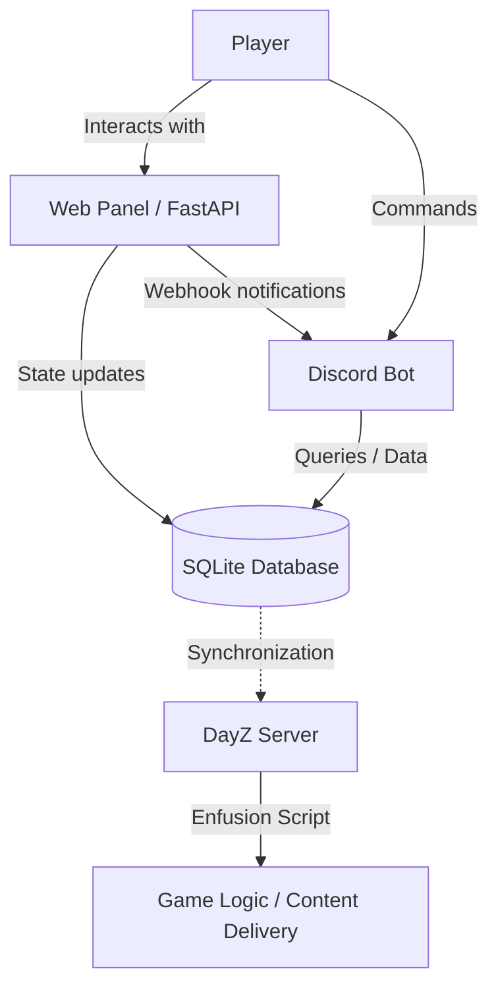

## Technology Stack

- Backend language and platform: Python.
- Web framework: FastAPI.
- Bot: discord.py.
- Game-side server logic: Enfusion Script (DayZ).
- Payments and integrations: webhook-based services.
- Infrastructure: Windows 10/11 Home/Pro.
- Database: SQLite3.

## Screenshots

Below is a section for demonstrating interfaces. Replace the files in docs/screenshots with your real screenshots.

### Web Interface

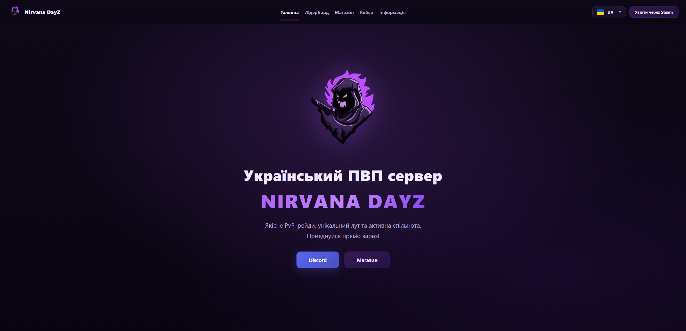
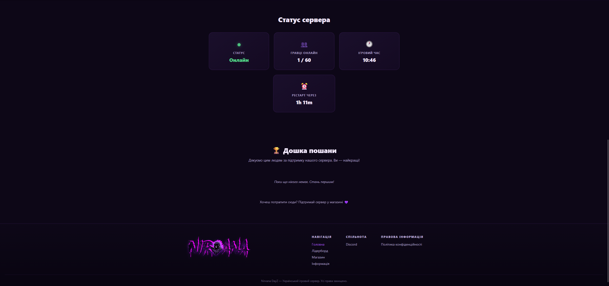

### Web Interface of Admin Panel
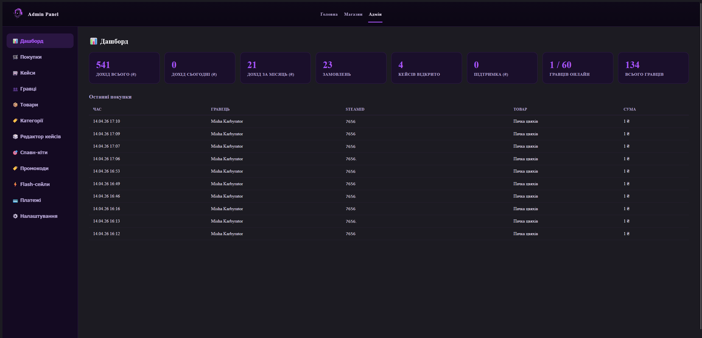
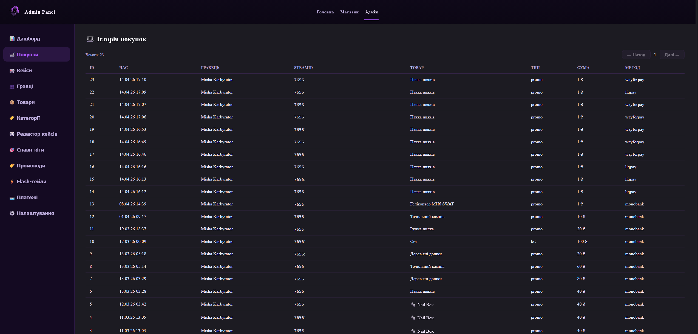
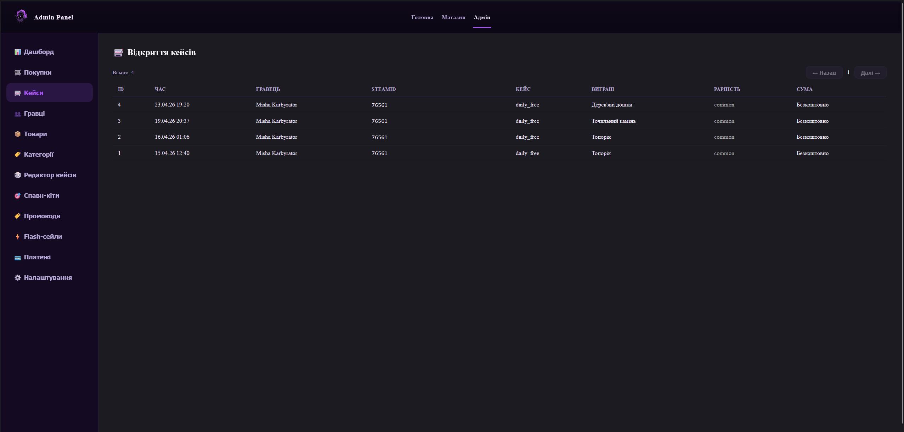
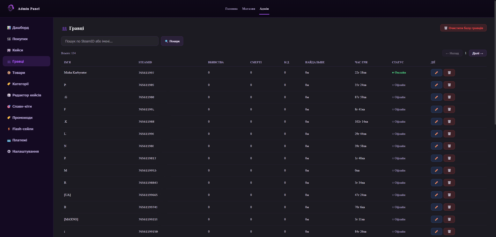
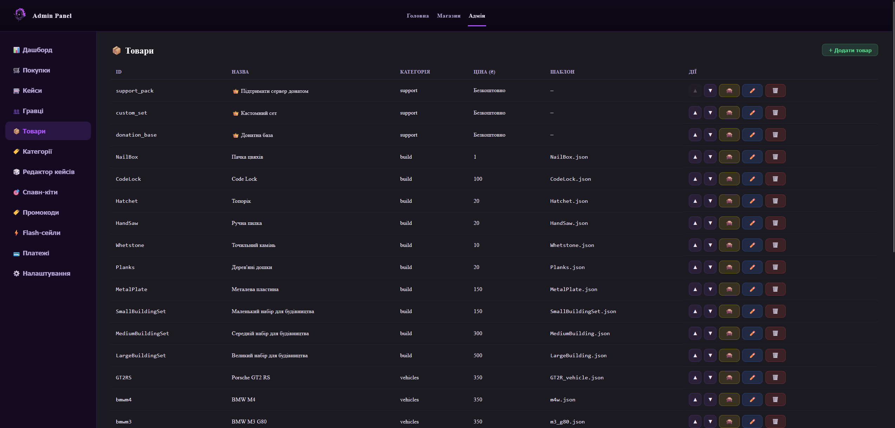
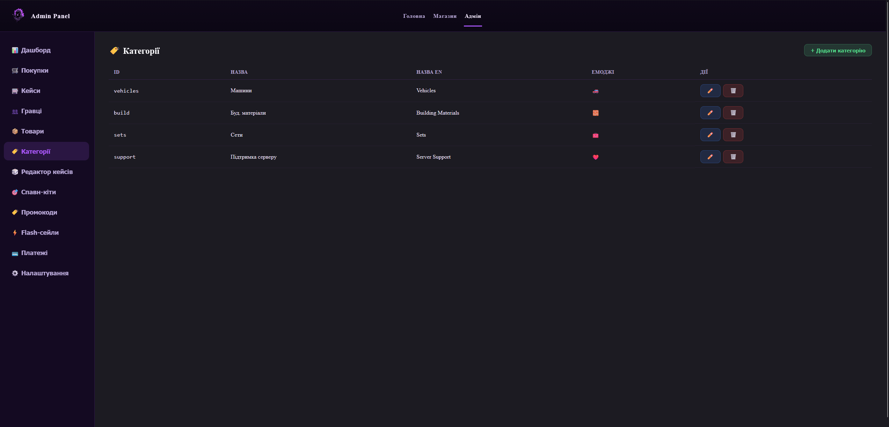
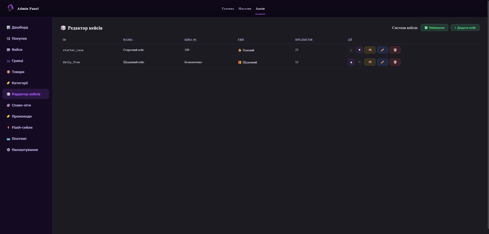
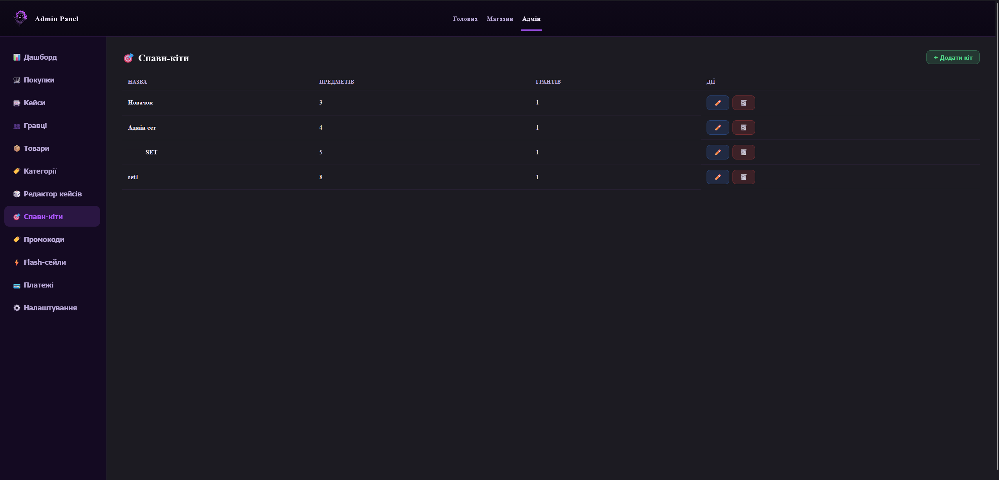
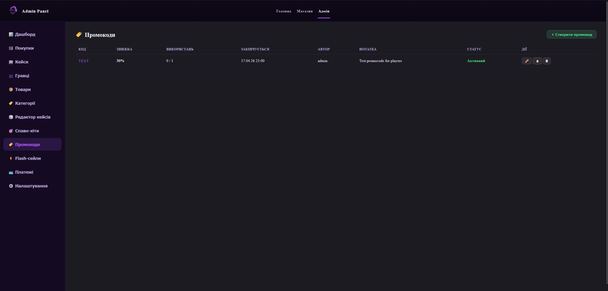
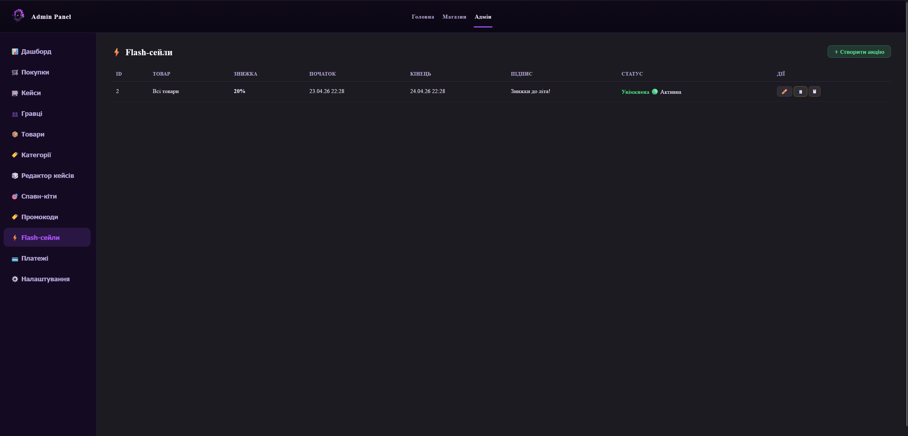
![Web Admin [Payment Methods]](docs/web-admin-payment-methods.png)
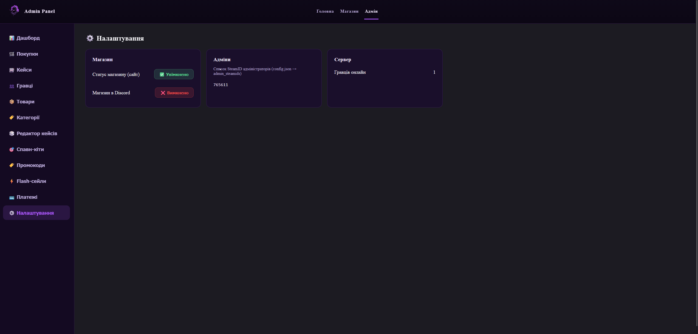

### Web Interface of Daily Cases
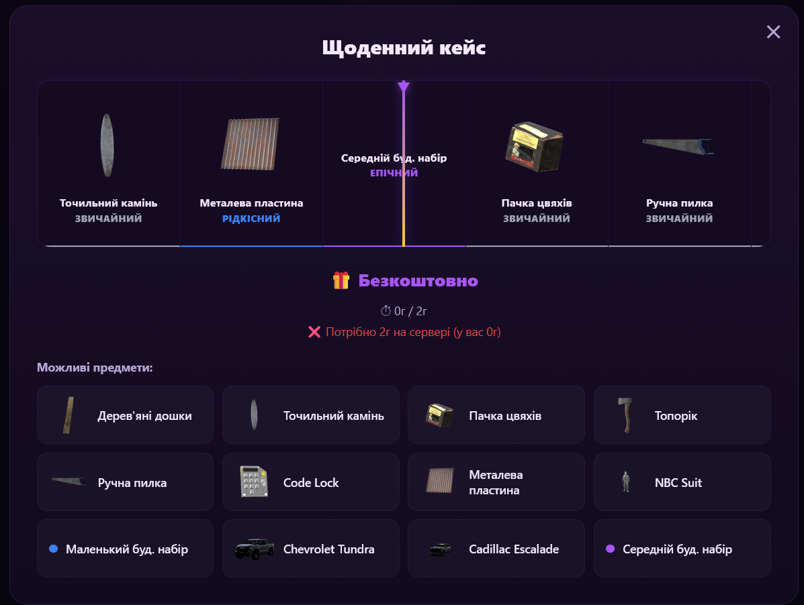

### Discord Bot

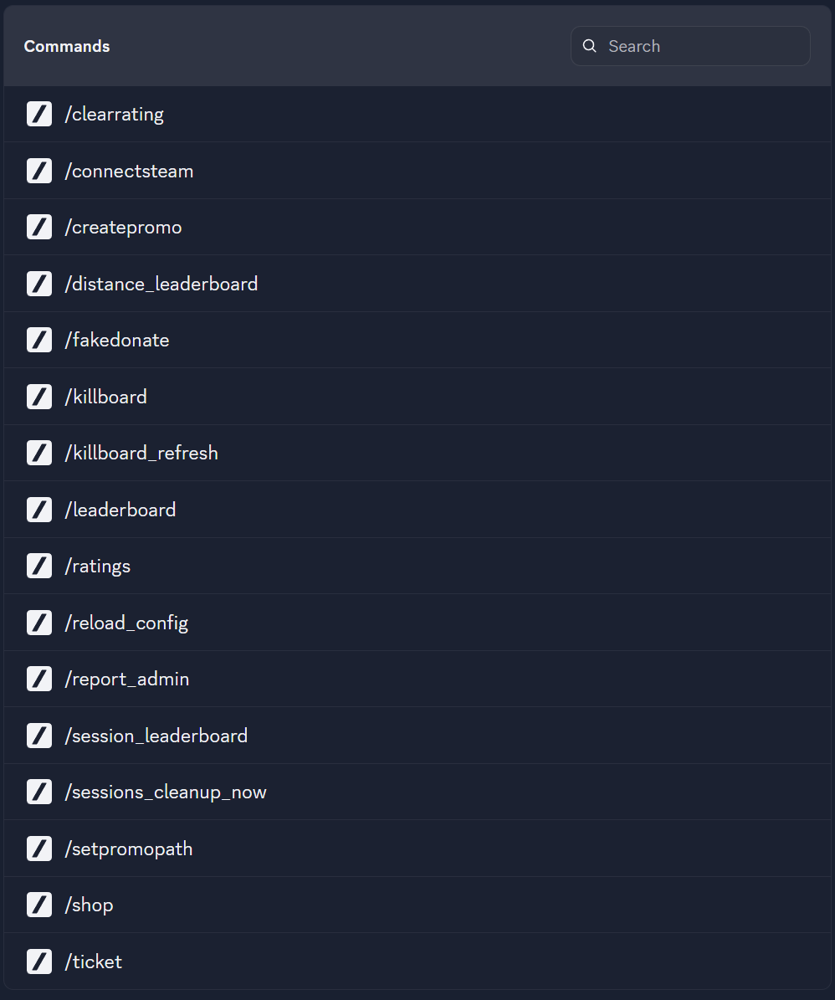
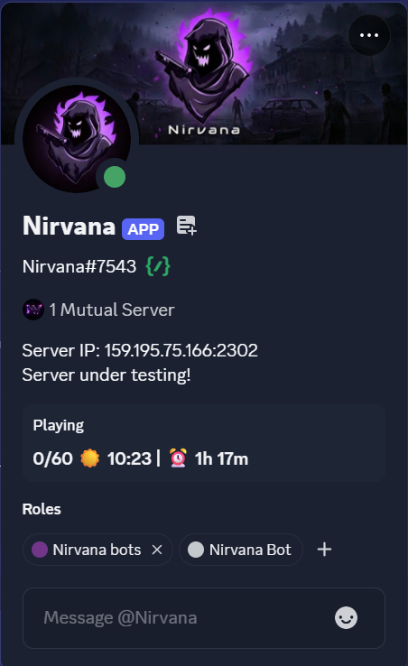

## Features

- Donation store with cases, plus coupon code creation for discounts; supports discounts on all products or individual items.
- Informational page where any information can be posted.
- User account page with personal player statistics and purchase history.
- Leaderboard page.
- Steam account authorization.
- Ability to buy items for another user when you have their SteamID.
- Product categorization.
- Daily rewards (free cases for hours played).
- English-language version of the site.
- Server status display.
- Hall of fame showing people who made voluntary donations to the server.

## Live Demo

- Public demo: https://nirvanadayz.me/
- Discord community: https://discord.gg/EGf9MzjEyy

## Source Code Status

The source code of this product is proprietary and is not published publicly.

This repository demonstrates:

- architectural approach,
- technology stack,
- UX/UI and usage scenarios,
- integration capabilities.

## Feedback

This repository demonstrates an architecture showcase solution for a gaming project that combines a DayZ server, web panel, and Discord bot into one management system.

The project implements automation of sales, content delivery, notifications, and administrative operations. The architecture is designed to reduce manual administration, simplify service integration, and provide transparent process control.

The repository is created as a demonstration example for those who want to evaluate the system capabilities before deploying them to their own gaming project.

## Contacts

- Discord: chort_lisoviy
- Email: niefjodovyehor@gmail.com
- GitHub: https://github.com/MoriNoAkuma