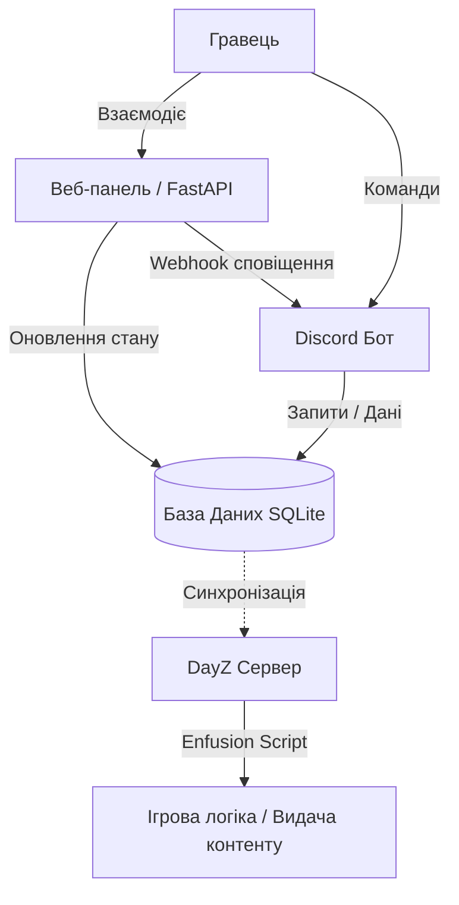
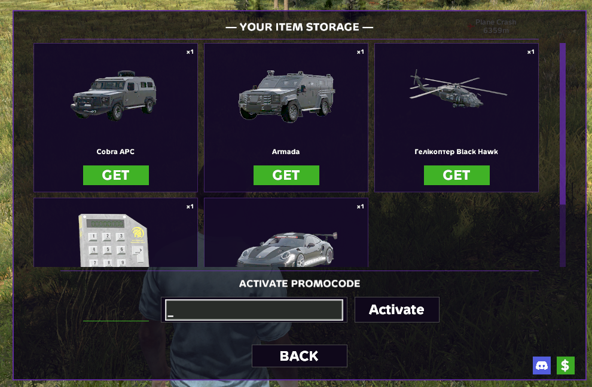
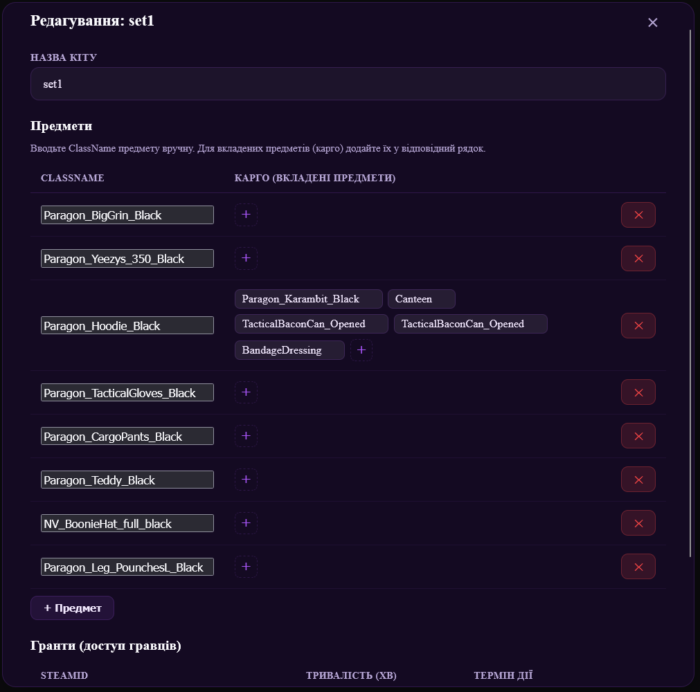

# Nirvana Architecture Showcase

Публічний репозиторій-візитка архітектури ігрової екосистеми, яка об'єднує DayZ сервер, веб-панель та Discord-бота в єдиний керований контур.

## Що вирішує ця екосистема

Екосистема автоматизує повний цикл взаємодії гравця з донат-системою:

1. Гравець взаємодіє з веб-магазином або Discord ботом.
2. Бекенд приймає оплату та валідує транзакцію.
3. Система готує видачу ігрового контенту для DayZ.
4. Адміністратори отримують прозорий контроль через веб-панель.
5. Сповіщення про покупки приходять в діскорд.

Результат: менше ручної роботи, швидша обробка покупок, зрозумілий контроль для адміністрації та кращий досвід для гравців.

## Архітектурна зв'язка

- DayZ ігровий сервер: виконання ігрової логіки та видача контенту.
- CFtools: логіка показу онлайну й виводу кіл-фіду в діскорд.
- Python backend API: бізнес-логіка, оплати, вебхуки, адміністративні дії.
- Discord бот: команди, інтеграція з ком'юніті, сповіщення, прив'язка SteamID.
- Веб-панель: магазин, керування контентом, службові інструменти.
- База даних: централізоване збереження транзакцій, станів та службових даних.

## Технологічний стек

- Мова та платформа backend: Python.
- Веб-фреймворк: FastAPI.
- Бот: discord.py.
- Ігрова логіка на стороні сервера: Enfusion Script (DayZ).
- Платежі та інтеграції: webhook-based сервіси.
- Інфраструктура: Windows 10/11 Home/Pro.
- База даних: SQLite3

## Скріншоти

Нижче секція для демонстрації інтерфейсів.

### Веб-інтерфейс

### Веб-інтерфейс Адмін Панелі

![Web Admin [Payment Methods]](docs/web-admin-payment-methods.png)

### Веб-інтерфейс Щоденних кейсів

### Discord-бот

## Функціональні можливості

- Донат магазин з кейсами, з можливістю створення промокодів на знижку, можливість робити знижки як на всі товари так і на окремі.
- Інформаційна сторінка, там можна розмістити любу інформацію.
- Сторінка акаунту користувача, там можна переглянути особисту статистику гравця та історію покупок.
- Сторінка з таблицею лідерів
- Авторизація через стім акаунт.
- Можливість купувати товар іншому користувачу, маючи його SteamID.
- Розділення товарів по категоріям.
- Щоденні нагороди (безкоштовні кейси за награні години).
- Англомовна версія сайту.
- Відображення статусу серверу.
- Дошка пошани, там відображаються люди які внесли добровільні пожертви для серверу.

## Модулі екосистеми

Ця екосистема залежить від обов’язкових DayZ-модів, які забезпечують основну внутрішньоігрову функціональність.

### Модулі
- Модуль внутрішньоігрового меню: поєднує інтерфейс гравця з екосистемою
- Модуль стартового кітa: автоматично видає стартові набори під час спавну гравця

Ці модулі є невід’ємною частиною системи та необхідні для повноцінної роботи.

### Модуль внутрішньоігрового меню

### Система стартового кітa
Систему стартового кітa можна керувати через браузер.

## Live Demo

- Публічне демо: https://nirvanadayz.me/
- Discord ком'юніті: https://discord.gg/EGf9MzjEyy

## Статус вихідного коду

Вихідний код цього продукту є пропрієтарним та не публікується у відкритому доступі.

Цей репозиторій показує:

- архітектурний підхід,
- стек технологій,
- UX/UI та сценарії використання,
- інтеграційні можливості.

## Зворотний зв'язок

Цей репозиторій демонструє архітектуру showcase-рішення для ігрового проєкту, що поєднує DayZ сервер, вебпанель та Discord-бота в одну систему керування.

У проєкті реалізовано автоматизацію продажів, видачі контенту, сповіщень та адміністративних операцій. Архітектура побудована так, щоб зменшити ручне адміністрування, спростити інтеграцію сервісів і забезпечити прозорий контроль за процесами.

Репозиторій створено як демонстраційний приклад для тих, хто хоче оцінити можливості системи перед впровадженням у власний ігровий проєкт.

## Контакти
- Discord: chort_lisoviy
- Email: niefjodovyehor@gmail.com
- GitHub: https://github.com/MoriNoAkuma